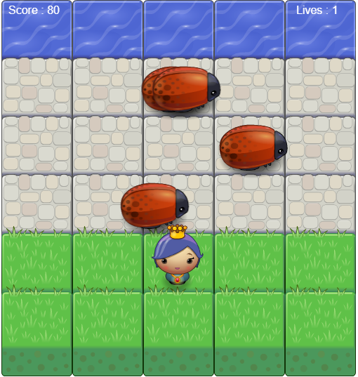

# Frogger

This is a Classic Arcade Game build using HTML Canvas,CSS and Object Oriented Javascript

## How to Play

In this game you have a Player and Enemies (Bugs). The goal of the player is to reach the water, without colliding into any one of the enemies. The player can move left, right, up and down. The enemies move in varying speeds on the paved block portion of the scene. Once a the player collides with an enemy, the game is reset and the player moves back to the start square. Once the player reaches the water the game is won.

## Special Features

	* When the player crosses water score is incremented by 100
	* When the player collides with the enemy life is decremented by 1 and score by 10
	* After game completion (when no of lives are 0) GAME OVER Alert comes on the screen
	* Game Over alert displayes score and high score of the player

## Screenshot of the Game

## Technologies Used
	
	* HTML Canvas
	* CSS
	* Object Oriented Javascript

